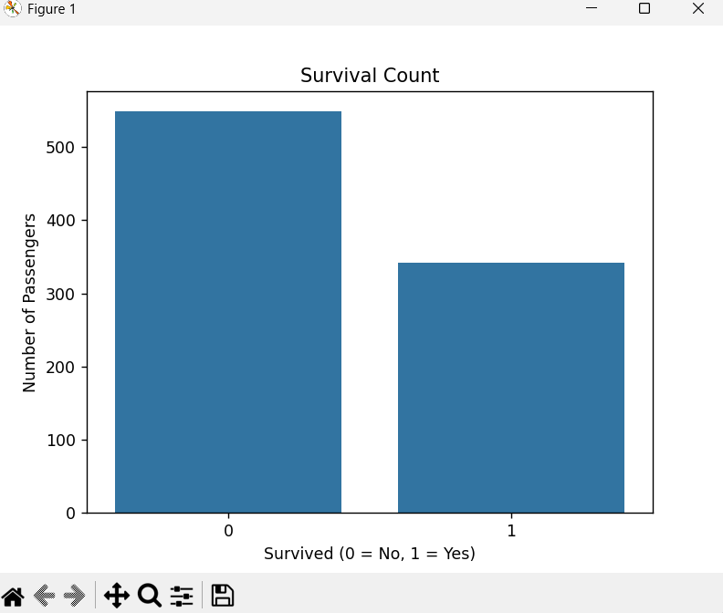
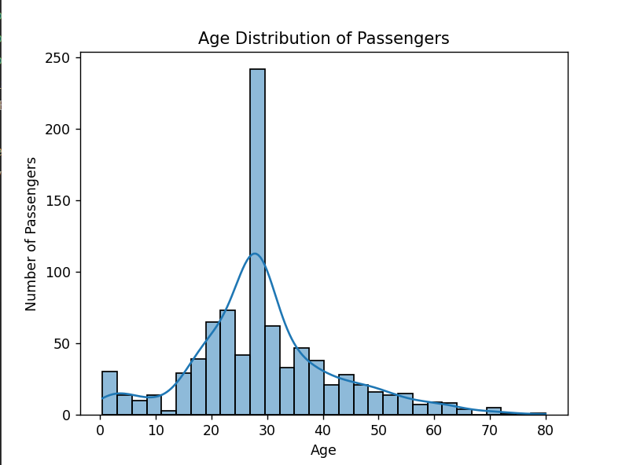
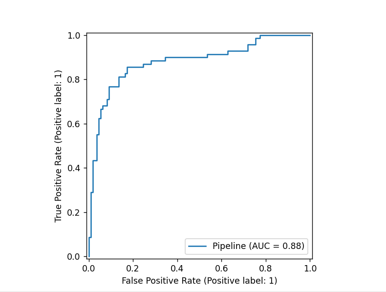

# Titanic Dataset - Exploratory Data Analysis & Machine Learning

## Project Overview
This project performs **data cleaning**, **exploratory data analysis (EDA)**, and **machine learning modeling** on the famous [Titanic Dataset](https://www.kaggle.com/c/titanic/data).  
The goal is to uncover patterns that influenced passenger survival and to build predictive models that estimate survival chances.

This project showcases:
- Data wrangling & preprocessing skills
- Exploratory data analysis & visualization
- Feature engineering & model building
- Model comparison and evaluation

---

## Dataset
- **Source:** [Kaggle Titanic Competition](https://www.kaggle.com/c/titanic/data)
- **Rows:** 891 passengers
- **Columns:** 12 features, including:
  - Passenger demographics (Age, Sex, etc.)
  - Ticket information (Pclass, Fare, etc.)
  - Family info (SibSp, Parch)
  - Survival status (Target variable)

---

## 🛠️ Steps Performed
### 1. Data Cleaning
- Removed irrelevant columns (`PassengerId`, `Ticket`)
- Dropped `Cabin` due to high missing percentage (~77%)
- Filled missing `Age` values with **median**
- Filled missing `Embarked` values with **mode**

### 2. Exploratory Data Analysis (EDA)
- Survival rate analysis (counts & percentages)
- Gender vs Survival
- Passenger Class vs Survival
- Age distribution & survival patterns
- Fare distribution & survival patterns
- Combination of class & gender impact on survival

**Example Visualizations:**
<p align="center">
  
  
    

</p>

---

### 3. Feature Engineering
- Label encoding for `Sex`
- One-hot encoding for `Embarked`
- Feature scaling for numeric variables
- Added interaction features (`FamilySize`, `IsAlone`)

---

### 4. Modeling
- **Logistic Regression** (baseline model)
- **Random Forest** (default)
- **Random Forest with Hyperparameter Tuning** (GridSearchCV)

---

## Model Comparison

| Model                    | Accuracy | ROC-AUC |
|--------------------------|----------|---------|
| Logistic Regression      | 0.854749     | 0.880369    |
| Random Forest (Default)  | 0.821229     | 0.831291    |
| Random Forest (Tuned)    | 0.826816     | 0.851252    |

---

## Key Insights
1. **Women** had a much higher survival rate than men.
2. **First-class passengers** were more likely to survive than third-class passengers.
3. Passengers traveling **alone** had lower survival chances compared to those with family.
4. **Fare price** was positively correlated with survival.

---

## How to Run!
```bash
# Clone the repository
git clone https://github.com/subixsh04/Exploratory-Data-Analysis.git
cd Exploratory-Data-Analysis

# Install dependencies
pip install -r requirements.txt

# Run the script
python titanic_eda.py
